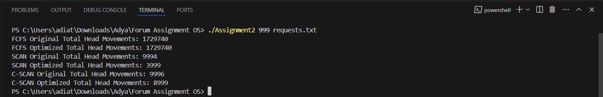

# OS Forum Assignment 2

## Instructions:

1. **Download Files**: Download the `Assignment2.c` file and the `requests.txt` file.

2. **Compile Code**: Write `gcc -o Assignment2 Assignment2.c` on the terminal.

3. **Run the Program**: Write `./Assignment2 999 requests.txt` on the terminal. Note that you can replace `999` with any number from 1 to 1000.

4. **View Results**: Here is the result:

   
